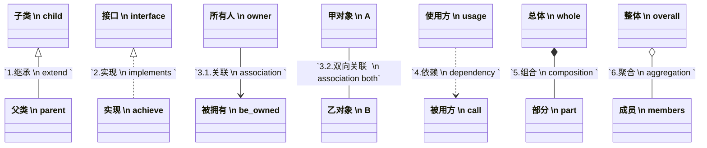

# UML Diagram 2.0
Unified Modeling Language

总共13个，根据是否随时间变化分类
- 结构图：静态结构
  - 1 类图 Class（分析类图、带字段类型和关系类型的设计类图）开发、架构
  - 2 对象图 Object（没有方法）开发
  - 3 组件图/构件图 Component 架构、高级开发
  - 4 部署图 Deployment 架构、运维、DevOps
  - 5 包图 Package 架构、开发负责人
  - 6 复合结构图 Composite Structure（2.0）架构、高级开发
- 行为图：动态行为
  - 1 用例图 Use Case 需求、产品经理、项目干系人
  - 2 活动图 Activity（类似流程图）需求、业务分析师、开发
    （2022下考题：描述工作流 BPMN、Petri-Net，不包括用例图）
  - 3 状态(机)图 State Machine / State Chart 开发
  - 交互图
    - 4 序列图/顺序图 Sequence（最常用）开发、架构、需求
    - 5 通信图 Communication（序列图的另一种视角，1.0叫协作图）开发、架构
    - 6 时序图 Timing（2.0）嵌入式开发工程师、实时系统工程师、硬件工程师
    - 7 交互概览图 Interaction Overview（2.0 活动+序列）架构、业务流程分析师

### 其他图

- 数据流图/DFD Data Flow 需求、系统分析师、业务流程分析师
- 模块图 Module（从上到下的树）架构、开发负责人、项目经理
- 实体联系图/ER图/ERD Entity-Relationship 后端开发、DBA（2022下考题：信息建模）
- 前驱图 Precedence Graph（2021下考题1、2020下考题1、2019下考题1）
  - 有向无环图 DAG Directed Acyclic Graph
- PAD 图 Problem Analysis Diagram（2022下考题：PAD 图不属于 UML）
  - 流程图矩形通过分支支持并发 Flowchart
  - 活动图圆角矩形支持并发同步异步，还支持泳道方式
  - PAD 图简单树形不支持并发

### 按角色

- 需求分析师/业务分析师：✅ 用例图（UML）✅ 活动图（UML）✅ 数据流图（非UML）✅ 序列图（UML）
- 系统架构师：         ✅ 组件图/构件图（UML）✅ 部署图（UML）✅ 包图（UML）✅ 模块图（通用）
- 数据库设计师：       ✅ 实体联系图（非UML）✅ 类图（UML - 用于概念建模）
- 开发人员：          ✅ 类图（UML）✅ 序列图（UML）✅ 状态机图（UML）

## 4+1 视图（2024年连考两次）
- 逻辑视图 Logical     View
  - 类图、对象图 -> 最终用户、系统分析师、架构师（描述系统功能需求）
- 开发视图 Development View
  - 构件图、包图 -> 程序员（软件管理、开发期质量属性）
  - 也叫作实现视图（Implementation View）
  - （2021下考题：描述了在开发环境中软件的静态组织结构）
- 进程视图 Process     View
  - 活动图、顺序图、状态图、协作图 -> 集成工程师 （运行期质量属性）
  - 也翻译作处理视图
  - （2021下考题：过程视图用于捕捉设计的并发同步特征）
- 物理视图 Physical    View
  - 部署图 -> 系统、网络工程师（拓扑、通信，安全和部署需求）
  - 也叫作部署视图（Deployment View）
- 场景视图 Scenarios   View
  - 用例图 -> 系统分析和测试人员（系统功能需求及其与外部用户之间的交互）
  - 也叫做用例视图（Use Cases View）
  - （2022下考题：1指的是)

2022下考题：体现了关注点分离的思想

2020下考题44：逻辑视图、进程视图、实现视图、（配置视图）

2020下考题45：逻辑视图来记录设计元素的功能和概念接口

### UML元模型
- M0 实例层 运行系统
- M1 模型层 UML
- M2 元模型层 UML元模型
- M3 元元模型层 MOF(Meta-Object Facility)

.xmi 文件（XML Metadata Interchange）

## 模型驱动架构 MDA
Model Driven Architecture
- CIM 计算无关模型 Computational Independent Model
- PIM 平台无关模型 Platform Independent Model （2022下考题：在不涉及实现的情况下对软件系统进行建模）
- PSM 平台相关模型 Platform Specific Model

## 结构图

### 类图 Class

- Java 的继承和实现 都是空心箭头，同样 Maven 的聚合 也是空心菱形
- 聚合和组合的区别是聚合的部分可以独立存在
- Maven 依赖不一定用到里面的类，所以是虚线
- Java 实现比继承关系弱，所以是虚线
- `+ public - private # protected ~ package`
- #围起来保护，可以+人的企业开放，-人的私有，波浪包可见

### 对象图 Object

### 组件图/构件图 Component

构件是一个功能相对独立的具有可复用价值的软件单元，特性有：
- 独立部署单元不可拆分
- 作为第三方的组装单元
- 没有（外部的）可见状态
- （2022下考题：×构件作为部署单元，是可拆分的）
- （2021下考题：×在一个特定进程中可能会存在多个特定构件的拷贝）

2022下考题：(接口)是一个己命名的一组操作的集合

2022下考题：
- 括适用于应用服务器的 EJB 模型和 COM＋模型 (考)
- 适用于Web服务器的 servlet模型和 Visual Basic 及其他技术（基于 ASP 技术）
- 同时适用于客户端和服务端的基于CLI的构件模型。微软的.NET框架

2021下考题：COM 支持两种形式的对象组装 重用形式
- 包含（或包容， Containment）
- 聚集（或聚合， Aggregation）

### 部署图 Deployment

### 包图 Package

### 复合结构图 Composite Structure

## 用例图 Use Case

- 描述用户（Actor）与系统功能（Use Case）的交互
- 包含、拓展、泛化，没有聚合关系（2024.5考）

### 活动图 Activity

### 状态(机)图 State Machine

## 序列图/顺序图 Sequence
- 角色、对象(顶部矩形)、生命线（竖虚线）、控制焦点（窄矩形）
- （2022下考题：对象之间的消息类型包括：同步、异步、返回、参与者创建、参与者销毁）
  - `-|>` 同步
  - ` ->` 异步
  - `<..` 返回
  - ` ↩ ` 自关联
- 块（2022下考题：等复杂交互使用序列片段 Fragment 来表示）
  - `Alt`   抉择
  - `Opt`   可选
  - `Loop`  循环
  - `Par`   并行
  - `Break` 中断
  - `Seq`   弱顺序
  - `ref`   引用
- 与协作图来自 UML 元模型的相同信息，语义等价，可以相互转换
- 协作图用于简单的交互过程，时序图用于复杂的交互场景

### 通信图 Communication （1.0的协作图）
由于Mermaid没有专门的通信图语法，我们通常用带有编号的流程图来模拟其结构和消息流。

### 时序图 Timing

### 交互概览图 Interaction Overview