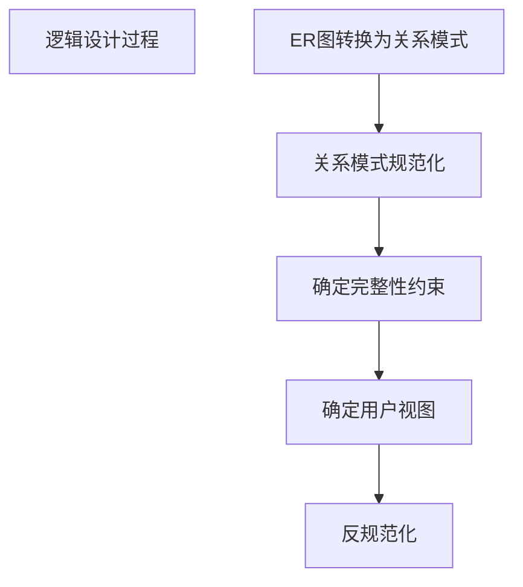

# 数据库设计

- 需求分析 --> 数据流图、数据字典、需求说明书
- 概念设计 --> ER 图 <-- 现实事物抽象：分类 聚集 概括
  ER 图 <-- 合并局部 ER 图
- 逻辑设计 --> 关系模式 --> 1-1 1-n n-n 多元 --> 属性的复合、派生、多值
  规范化设计 反向规范化设计【逻辑】（2024上考题）
  完整性约束
- 物理设计
- 实施
- 运行维护

### 表设计文档说明范式遵循与违反的考虑（逻辑设计阶段）

依赖 X->Y：表示 X 的值唯一确定 Y 的值
- 1NF： 列不可再分
- 2NF： 消除部分依赖  （即要求依赖主键的所有列）【只】消除非主属性对码的部分依赖
- 3NF： 消除传递依赖  （即非主键列不能依赖非主键字列）
- BCNF：消除主属性依赖（即主键列不能依赖主键列）
- 4NF： 消除多值依赖  （即不能拆成两表笛卡尔积）
- 5NF： 消除连接依赖  （即不能拆成两表连接）
- 6NF： 一个非主属性

### 反向规范化设计需保证事务一致，方法：触发器、应用逻辑、批处理、事务机制）（2021下案例4.1：案例9）
- 增加冗余列
- 增加【派生列】（其他数据计算生成）
- 重新组表（两个表重新组成一个表减少连接）
- 水平分割表
- 垂直分割表

### 反规范设计数据不一致性问题的三种解决方法
- 应用程序同步
- 批处理同步
- 触发器同步

2021下案例4.3
- ZSet排名
- 读数据时先读取Redis 中的key，
  - 如读到且未失效则返回key对应的数据；
  - 如读不到或key 失效，则读取数据库，并同步Redis；
- 写数据时先写数据库，并设置内存对应的key失效。